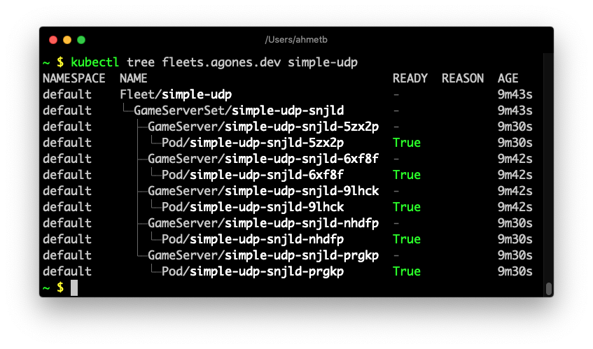

  

# kubectl tree

A kubectl plugin to explore ownership relationships between Kubernetes objects
through `ownersReferences` on the objects.

The [`kubectl lineage`](https://github.com/tohjustin/kube-lineage) plugin is very similar to `kubectl tree`, but it 
[understands](https://github.com/tohjustin/kube-lineage#supported-relationships)
logical relationships between some API objects without needing ownerReferences.

## Installation

Use [krew](https://krew.sigs.k8s.io/) plugin manager to install:

    kubectl krew install tree
    kubectl tree --help

## Demo

Example (Deployment):

Example (Knative Service):

Example (Agones Fleet):

## Flags

By default, the plugin will only search "namespaced" objects in the same
namespace as the specified object.

You can use the `-A` or `--all-namespaces` flag to search namespaced and
non-namespaced objects in all namespaces.

## Author

Ahmet Alp Balkan [@ahmetb](https://twitter.com/ahmetb).

**Special acknowledgement:** This tool is heavily inspired by @nimakaviani's
[knative-inspect](https://github.com/nimakaviani/knative-inspect/) as it's a
generalized version of it.

## License

Apache 2.0. See [LICENSE](./LICENSE).

---

This is not an official Google project.
