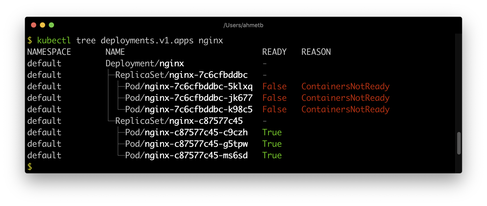
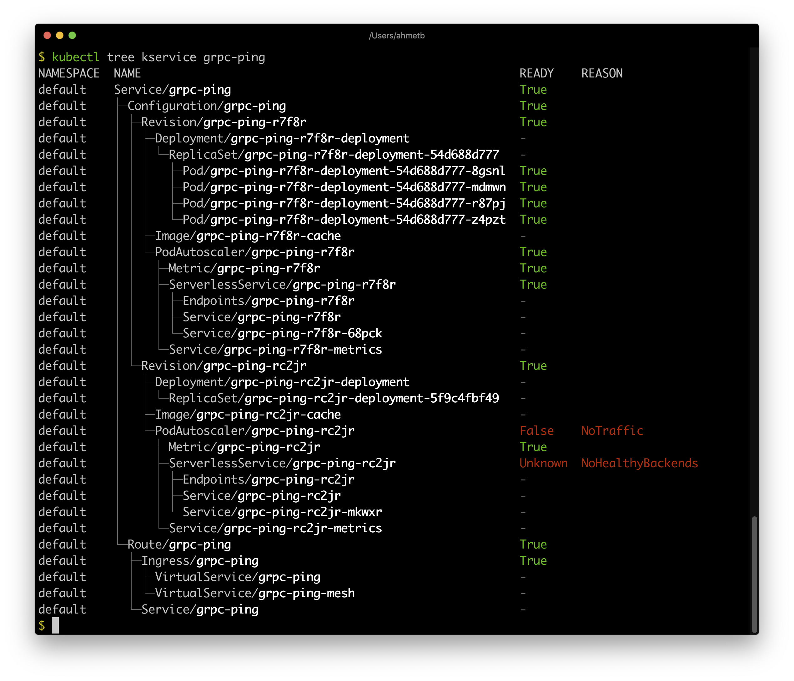

# kubectl tree

A kubectl plugin to explore ownership relationships between Kubernetes objects
through ownersReferences on them.

## Installation

> **NOTE:** This is still not working as I'm packaging it for Krew.

Use [krew](https://sigs.k8s.io/krew) plugin manager to install

    kubectl krew install tree
    kubectl tree --help

## Demo

Example (Deployment):

Example (Knative Service):

## Author

Ahmet Alp Balkan [@ahmetb](https://twitter.com/ahmetb).

**Special acknowledgement:** This tool is heavily inspired by @nimakaviani's
[knative-inspect](https://github.com/nimakaviani/knative-inspect/) as it's a
generalized version of it.

## License

Apache 2.0. See [LICENSE](./LICENSE).

---

This is not an official Google project.
