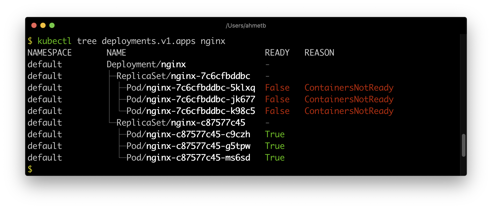
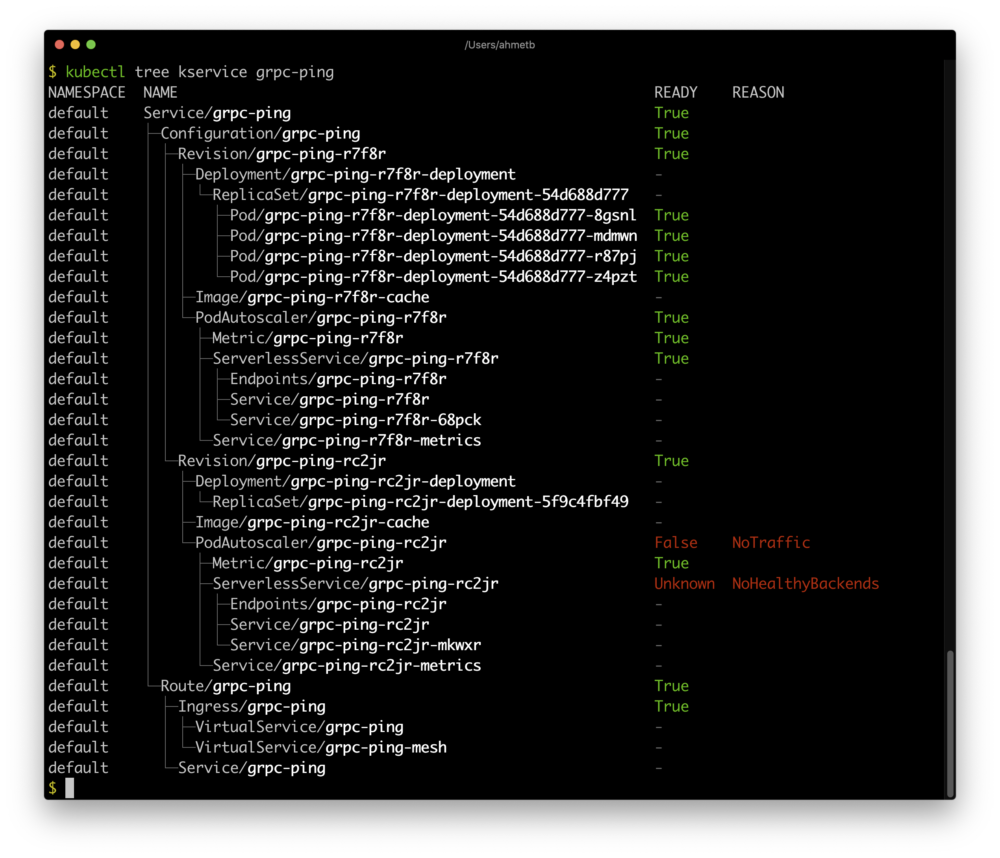
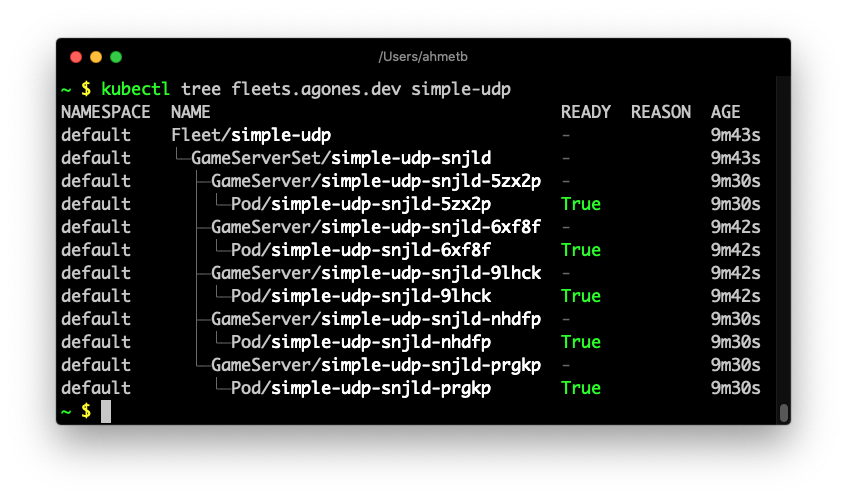

<p align="center">
  <a href="https://mdxjs.com">
    
  </a>
</p>

# kubectl tree

A kubectl plugin to explore ownership relationships between Kubernetes objects
through `ownersReferences` on the objects.

The [`kubectl lineage`](https://github.com/tohjustin/kube-lineage) plugin is very similar to `kubectl tree`, but it
[understands](https://github.com/tohjustin/kube-lineage#supported-relationships)
logical relationships between some API objects without needing ownerReferences.

## Installation

Use [krew](https://krew.sigs.k8s.io/) plugin manager to install:

    kubectl krew install tree
    kubectl tree --help

## Demo

Example (Deployment):



Example (Knative Service):



Example (Agones Fleet):



## Flags

By default, the plugin searches only namespaced objects in the same namespace
as the specified object.

Tree-specific flags:

- `-A`, `--all-namespaces`: Search namespaced and non-namespaced objects in all namespaces.

- `-n`, `--namespace`: Namespace scope for the CLI request.

- `-c`, `--color`: Control color output. Supported values are `always`, `never`, and `auto` (default).

- `-l`, `--selector`: Selector (label query) to filter on. Supports equality (`=`, `==`, `!=`), set-based (`in`, `notin`), and existence operators. Examples:
  - `-l key1=value1,key2=value2` (equality)
  - `-l "env in (prod,staging)"` (set-based)
  - `-l "tier=frontend,env!=test"` (mixed)

  This helps reduce workload and data volume when working with large clusters.

- `--condition-types`: Comma-separated list of condition types to check. Default: `Ready`. Example: `Ready,Processed,Scheduled`.

- `--api-groups`: Comma-separated list of API groups to include in the query. When not set, all API groups are included. Supports globs. Example: `--api-groups=core,cluster.x-k8s.io,*.cert-manager.io`.

- `--resources`: Comma-separated list of resource types to include in the query. When not set, all resources are included. Supports globs. Example: `--resources=deployments,rs,pods`.

  Resource filters accept kind, singular, plural, and short names. For example, `ReplicaSets`, `replicasets`, `replicaset`, and `rs` all match the same resource.
  Globs are also supported, for example `*sets`.

Both `--resources` and `--api-groups` support glob matching and can narrow the APIs and resources included while building the tree. This can significantly reduce workload and data usage in large clusters.
If an intermediate owner resource is filtered out, traversal stops at that point and child resources below it will be missing, even if the leaf resource or API would otherwise match.
For example, using `--resources=deployments,pods` will return nothing because `replicasets` are not included and `pods` are not directly owned by `deployments`.

Globs can be negated by prefixing a `!`, for example:

```sh
kubectl tree --api-groups '*.custom.api,*cluster.x-k8s.io' --resources '!customresource' cluster my-cluster
```

Inherited `kubectl` flags:

- `-h`, `--help`: Show command help.

- Standard `kubectl` client and authentication flags are also supported, including `--kubeconfig`, `--context`, `--cluster`, `--user`, `--server`, `--token`, `--as`, `--as-group`, `--as-uid`, `--as-user-extra`, `--certificate-authority`, `--client-certificate`, `--client-key`, `--tls-server-name`, `--insecure-skip-tls-verify`, `--request-timeout`, `--disable-compression`, and `--cache-dir`.

- `-v`: Set log verbosity level.

## Author

Ahmet Alp Balkan [@ahmetb](https://twitter.com/ahmetb).

**Special acknowledgement:** This tool is heavily inspired by @nimakaviani's
[knative-inspect](https://github.com/nimakaviani/knative-inspect/) as it's a
generalized version of it.

## License

Apache 2.0. See [LICENSE](./LICENSE).

---

This is not an official Google project.
